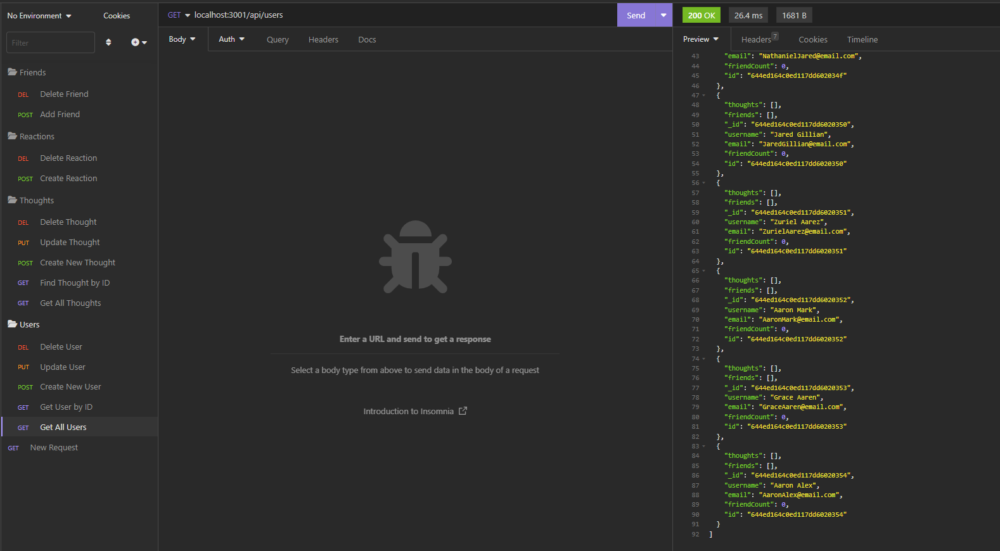

# Social Mongoose Network

## Description

This is a NoSQL API that allows users to share their thoughts, react to friends' thoughts and create a friend list. It uses Express.js for routing, a MongoDB database, and the Mongoose ODM. This social network web application was created as a back-end project for the University of Denver Coding Bootcamp. 

## Table of Contents

- [Installation](#installation)
- [Usage](#usage)
- [Credits](#credits)
- [License](#license)

## Installation

From your terminal, install mongoose and express, then clone the code from this repo into your terminal.

## Usage

Open the integrated terminal from your index.js file. Run npm run seed. Your database will then be created! Run npm start. You can then use Insomnia to test the routes.

### Screenshots

     Get All Users

    Create a New Thought

    Add a Reaction to a Thought

### Video Link

https://drive.google.com/file/d/1BhU06UvRk1NosUCoQe0NHU1cyiIIcQWj/view

## Credits

### Code sources: 

- Challenge 18 Activities 22 and 24 and Challenge 18 Mini-Project
- Mastering JS "How to Validate Unique Emails with Mongoose":  https://masteringjs.io/tutorials/mongoose/mongoose-validate-unique-email

## License

